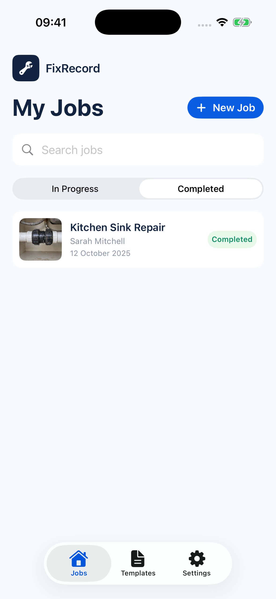

# FixRecord

[AGPL-3.0 licensed](LICENSE)

**Capture. Create. Share.** A local-first iPhone app for documenting completed work and turning it into professional reports and invoices.



## Start here

- [Judge walkthrough and configuration](docs/JUDGING.md)
- [Submission checklist and current limits](docs/SUBMISSION.md)
- [Draft entry description](docs/ENTRY.md)

Free: jobs, optional photos, on-device dictation and receipt scanning, business name/contact details, and separate report/invoice PDFs. Pro: nine additional templates, custom logo, removal of the small FixRecord footer, and the combined Client Pack. The Test Store offering is US$4.99/month or US$39.99/year, with a seven-day trial for eligible new purchasers. Prices and eligibility are fetched from RevenueCat.

## Run the app

1. Open `FixRecord.xcodeproj` in Xcode 26.3 or later. The deployment target is iOS 17.
2. Let Xcode resolve the RevenueCat Swift package. The OpenCV Mobile 4.13.0 XCFramework is included in `ThirdParty/` with device and Apple Silicon/Intel simulator slices.
3. Select an iPhone simulator and run. There is no sign-in. Onboarding asks whether to add an example job or create your own.
4. Choose **Add Example Job** on the final onboarding page. It appears under **Completed**. The fictional Kitchen Sink Repair record is labelled as an example and can be deleted from Jobs. To replay onboarding in a disposable simulator, uninstall the app and run again; this deletes that installation’s local data.
5. Open a job’s **Photos** page to capture Before and After images and use the MatchShot ghost overlay. On a simulator, choose images from Photos; the camera needs a device.
6. Dictate or type **Reported Issue** and **Work Completed**. On-device dictation needs microphone and speech-recognition permission and a supported language. Typing remains available.
7. Scan a receipt with the single-capture camera or import one from Photos, review its OCR suggestions, then add confirmed materials. Open **Materials & Pricing** for Decimal totals and **Preview & Export** for PDFs.

The before and after sample photos are original generated demo assets. They depict a fictional repair and are provided only to exercise the app.

## Test on your iPhone

A free Apple Account is enough to install FixRecord on your own iPhone through Xcode. You do not need a paid Apple Developer Program membership for this local test. The phone must run iOS 17 or later.

1. Connect the iPhone to the Mac with a cable, unlock it, and accept **Trust This Computer** on the phone if prompted.
2. In Xcode, open **Xcode → Settings → Apple Accounts** and sign in with the Apple account intended for this local test.
3. Open `FixRecord.xcodeproj`. Select the app target under **Signing & Capabilities**, enable automatic signing and choose your development team. Use a unique bundle identifier if Xcode asks for one. Keep machine-specific team IDs out of the shared project.
4. Select the connected iPhone as the run destination. On the phone, enable **Settings → Privacy & Security → Developer Mode** if Xcode asks for it; the phone will restart and ask you to confirm with its passcode. The option may appear only after pairing begins.
5. Press **Run** in Xcode. Allow camera, microphone and speech access when prompted. Choose the example during onboarding, then create a job and take real before and after photos to test MatchShot.
6. To test Pro, set the app target's **Debug** `REVENUECAT_API_KEY` build setting to the public RevenueCat Test Store key (`test_…`), rebuild, then open **Settings → FixRecord Pro**. The Test Store makes no real charge. Keep Release free of Test Store keys.

With a free Personal Team, Apple says the provisioning profile expires after seven days; rebuild and reinstall from Xcode when needed. The repository can stay private throughout phone testing.

### Run checks

```sh
xcodebuild test -project FixRecord.xcodeproj -scheme FixRecord \
  -destination 'platform=iOS Simulator,id=YOUR_SIMULATOR_UDID' CODE_SIGNING_ALLOWED=NO
cd backend && npm ci && npm run typecheck && npm test
```

Find a simulator UUID with `xcrun simctl list devices available`. Tests use synthetic/sample data and do not need an AI key or purchase credentials.

The Xcode project links [RevenueCat's iOS SDK](https://www.revenuecat.com/docs/getting-started/installation/ios) and [OpenCV Mobile](https://github.com/nihui/opencv-mobile). The bundled XCFramework makes MatchShot available in the simulator without a separate OpenCV installation. The Objective-C++ bridge is isolated in `MatchShotBridge.mm`.

## RevenueCat Test Store

Create a RevenueCat project with a Test Store app, an offering and a `pro` entitlement attached to its products. Set the app target's `REVENUECAT_API_KEY` build setting to the **public Test Store SDK key** (`test_…`) for Debug builds. You can also pass it to `xcodebuild` as `REVENUECAT_API_KEY=test_…`. The key is substituted into `FixRecord/Info.plist` at build time. Never put a RevenueCat secret API key in the app. The Upgrade screen reads packages from RevenueCat and supports purchase and restore. Pro controls Client Pack export, custom logo display, premium templates and removal of FixRecord branding; Work Report and Invoice exports remain free.

A Test Store purchase shows RevenueCat's simulated purchase sheet. It does not require App Store Connect. See the [Test Store guide](https://www.revenuecat.com/docs/test-and-launch/sandbox/test-store). **Do not ship a release build with a Test Store key**; replace it with the platform-specific public key first. Project-specific build settings are deliberately not committed. For the local phone validation on 26 September 2026, the Debug build used the existing FixRecord Test Store key, the `default` offering and the `pro` entitlement. A simulated monthly purchase activated Pro, and Restore Purchases returned “Pro restored”. These checks do not establish production billing readiness. A fresh checkout still needs its public SDK key supplied at build time.

## Optional AI note assistance

The manual note always works. To enable **Improve with AI**, deploy `backend/` to Vercel and set its environment variables from `backend/.env.example`: a server-side `OPENAI_API_KEY`, both Upstash Redis REST variables, and access codes. Generate random codes of at least 20 characters for Free and Pro testing (for example, with `openssl rand -hex 16`). Store Free codes in `AI_ACCESS_CODES` and Pro demo codes in `AI_PRO_ACCESS_CODES`, as comma-separated backend environment values. Give judges the appropriate code privately; the app prompts for it when they first tap **Improve with AI**, or they can enter it under **Settings → AI Access Code**. Never commit codes or put one in the app build. The model defaults to `gpt-6-luna`; `OPENAI_MODEL` can override it. Hosted deployments fail closed if Redis limits are missing. Set the app target's `AI_ENDPOINT` build setting to the HTTPS URL ending in `/api/generate-report`, or pass `AI_ENDPOINT=https://…` to `xcodebuild`. No OpenAI key or server URL is committed to this repository. Until the backend is deployed and the endpoint is set, the app leaves the AI action unavailable.

An AI request includes available job title, reported issue, work note, material names and locale. It also includes up to one Before and one After photo, resized and re-encoded as JPEG without original image metadata. The backend uses the code to determine the demo tier and an installation ID to enforce the monthly allowance; neither is sent to OpenAI. A work note or a photo is required to enable the action. Photos are visual context and do not prove the repair, testing or safety.

The backend limits input length and image size, requests per minute/day per installation and client IP, monthly AI requests per installation (3 Free or 30 Pro, including retries), and a server-wide judging cap of 1,000 admitted requests in total. Different installations can share a code and have separate monthly allowances. The judging cap does not reset with a new installation, code, calendar month or server redeployment: its Redis key has no expiry. Clearing or replacing Redis resets it, so retain that store throughout judging. Local development uses process memory and resets on restart; hosted Vercel deployments require Redis. Installation IDs are client supplied and can be reset or spoofed; the overall 1,000-request cap is the budget backstop, not a guarantee of one allowance per person. For this submission, the backend determines Free or Pro AI allowance from the private code list, independently of RevenueCat's Test Store entitlement. Real purchase-to-quota linking is required before any paid launch. The configured Test Store plans are US$4.99 per month and US$39.99 per year; the actual localised price and billing come from a configured RevenueCat offering. No live payment product is configured in this checkout. It requests structured JSON, times out, and returns generic errors without logging secrets. A user must review and explicitly accept any AI-assisted draft. It is a writing aid; it does not verify repairs or safety.

## How it is organised

- `Models.swift`: SwiftData jobs/profile, photo and receipt references, Decimal invoice maths, sample fixture.
- `CameraAndReceipts.swift`: AVFoundation camera, Photos import, ghost overlay, image-quality notice, single-capture receipt camera with auto-detection, image preparation, editable Vision OCR suggestions and total checks.
- `SpeechInput.swift`: on-device Apple Speech dictation for reported issues and work-completed notes.
- `DesignScreens.swift`: onboarding, photo review, settings, templates and document options.
- `MatchShotBridge.mm`: scaled OpenCV ORB feature matching and geometric consistency check after capture. Low-confidence matches give neutral guidance. The ghost overlay remains available without an alignment result.
- `NotesPricingPurchase.swift`: note editing/AI client, itemised pricing and RevenueCat entitlement service.
- `PDFExport.swift`: photo-led A4 work report, itemised invoice, real previews, optional sections and share, Files and print actions.
- `backend/api/generate-report.ts`: optional server-side AI rewrite. The API key stays on the server.

Job records live in SwiftData. Photos and receipt images live as files in the app's Application Support directory. The app has no sign-in requirement. Deleting the app deletes local records unless they were exported or backed up by the user.

## Current scope

MatchShot's OpenCV analysis runs after capture, with a live ghost overlay while framing. Voice transcription runs on-device when supported. Receipt OCR uses on-device original/enhanced passes and proposes editable rows. It flags unclear readings and inconsistent totals and never adds items without confirmation. It cannot guarantee every receipt layout; tax and discounts are not silently added to material prices. PDF report and invoice export, sample mode and manual notes work offline. The AI writing action needs a hosted endpoint; if unavailable, the original note remains usable. Cloud backup, accounts, client portal, payment collection and automatic repair verification are outside this build.

## Licences and acknowledgements

FixRecord source is AGPL-3.0; see [LICENSE](LICENSE). RevenueCat's Purchases SDK is MIT licensed. The bundled OpenCV Mobile 4.13.0 binary and OpenCV 4.13.0 are Apache-2.0 licensed. Licence texts are in `ThirdParty/`. Apple frameworks are provided by the iOS SDK. The sample photos are original generated demo assets. Review third-party notices before redistribution.
