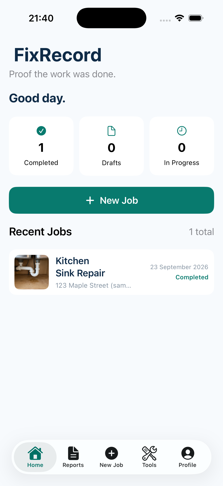
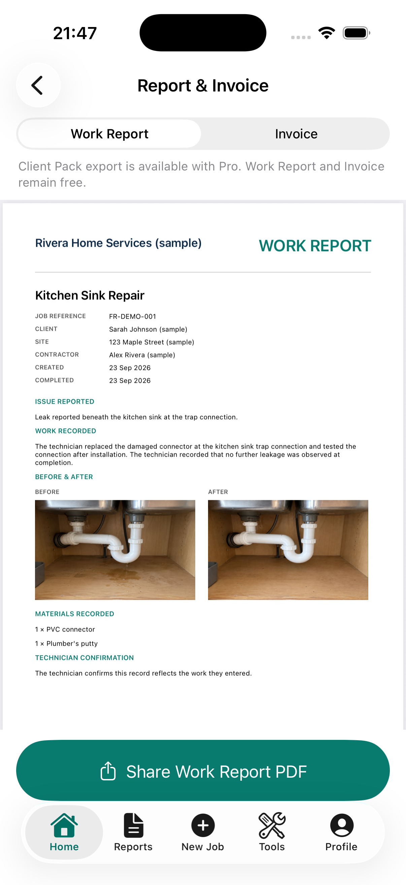

# FixRecord

[AGPL-3.0 licensed](LICENSE)

**Proof the work was done.** A local-first iPhone app for documenting field work, matching before and after photos, recording materials and labour, and exporting a work report and invoice.

| Sample Home | Work Report preview |
| --- | --- |
|  |  |

## Run the app

1. Open `FixRecord.xcodeproj` in Xcode 26.3 or later. The deployment target is iOS 17.
2. Let Xcode resolve the RevenueCat Swift package. The OpenCV Mobile 4.13.0 XCFramework is included in `ThirdParty/` with device and Apple Silicon/Intel simulator slices.
3. Select an iPhone simulator and run. No login, AI account, or purchase is needed for the manual workflow.
4. Tap **Tools → Load Sample Job**, then open **Kitchen Sink Repair**. Its names, address, photos and prices are sample data.
5. Open the before and after steps to see the ghost overlay. On a simulator, use imported images; the camera needs a device.
6. Open **Materials & Pricing** to inspect Decimal totals, then **Report & Invoice** to preview and share PDFs.

The before and after sample photos are original generated demo assets. They depict a fictional repair and are provided only to exercise the app.

## Test on your iPhone

A free Apple Account is enough to install FixRecord on your own iPhone through Xcode. You do not need a paid Apple Developer Program membership for this local test. The phone must run iOS 17 or later.

1. Connect the iPhone to the Mac with a cable, unlock it, and accept **Trust This Computer** on the phone if prompted.
2. In Xcode, open **Xcode → Settings → Apple Accounts** and add **Andrea's Apple Account**. Confirm that Xcode shows Andrea's **Personal Team**. Do not select someone else's team for FixRecord.
3. Open `FixRecord.xcodeproj`. Select the **FixRecord** project, then the **FixRecord** app target, then **Signing & Capabilities**. Turn on **Automatically manage signing** and select Andrea's Personal Team. If Xcode says the bundle identifier is unavailable, change it to a unique value such as `com.andreajanewilliams.fixrecord`.
4. Select the connected iPhone as the run destination. On the phone, enable **Settings → Privacy & Security → Developer Mode** if Xcode asks for it; the phone will restart and ask you to confirm with its passcode. The option may appear only after pairing begins.
5. Press **Run** in Xcode. Allow camera and photo-library access when FixRecord asks. Use **Tools → Load Sample Job** to inspect the existing flow, then create a new job and take real before and after photos to test the camera and MatchShot guidance.
6. To test Pro, set the FixRecord app target's **Debug** `REVENUECAT_API_KEY` build setting to Andrea's public RevenueCat Test Store key (`test_…`), rebuild, then open **Profile → Upgrade / RevenueCat Test Store**. The test sheet makes no real charge. Keep the Release build free of Test Store keys.

With a free Personal Team, Apple says the provisioning profile expires after seven days; rebuild and reinstall from Xcode when needed. The repository can stay private throughout phone testing.

### Run checks

```sh
xcodebuild test -project FixRecord.xcodeproj -scheme FixRecord \
  -destination 'platform=iOS Simulator,name=iPhone 17 Pro' CODE_SIGNING_ALLOWED=NO
cd backend && npm install && npm run typecheck
```

The Xcode project links [RevenueCat's iOS SDK](https://www.revenuecat.com/docs/getting-started/installation/ios) and [OpenCV Mobile](https://github.com/nihui/opencv-mobile). The bundled XCFramework makes MatchShot available in the simulator without a separate OpenCV installation. The Objective-C++ bridge is isolated in `MatchShotBridge.mm`.

## RevenueCat Test Store

Create a RevenueCat project with a Test Store app, an offering containing monthly/annual packages, and a `pro` entitlement attached to those products. Set the app target's `REVENUECAT_API_KEY` build setting to the **public Test Store SDK key** (`test_…`) for Debug builds. You can also pass it to `xcodebuild` as `REVENUECAT_API_KEY=test_…`. The key is substituted into `FixRecord/Info.plist` at build time; check the built app's `Info.plist` if the Upgrade screen reports that no key is configured. Never put a RevenueCat secret API key in the app. The Upgrade screen reads package titles and prices from RevenueCat, supports purchase and restore, and grants Client Pack export only while the `pro` entitlement is active. Work Report and Invoice exports remain free.

A Test Store purchase shows RevenueCat's simulated purchase sheet. It does not require App Store Connect. See the [Test Store guide](https://www.revenuecat.com/docs/test-and-launch/sandbox/test-store). **Do not ship a release build with a Test Store key**; replace it with the platform-specific public key first. This checkout has no project-specific RevenueCat key, offering or hosted backend configured, so those live flows need your own account configuration.

## Optional AI note assistance

The manual note always works. To enable **Improve with AI**, deploy `backend/` to Vercel and set its environment variables from `backend/.env.example`: `OPENAI_API_KEY`, a compatible `OPENAI_MODEL`, and both Upstash Redis REST variables. Hosted deployments fail closed if Redis limits are missing. The endpoint sends only the job title, issue, rough note, material names, locale and a local install ID. It sends no photos. Set the app target's `AI_ENDPOINT` build setting to the HTTPS URL ending in `/api/generate-report`, or pass `AI_ENDPOINT=https://…` to `xcodebuild`.

The backend limits input length, requests per minute/day per installation and client IP, monthly assisted jobs (10 Free or 100 Pro, with up to five rewrites per job), and the server-wide daily budget. Set `REVENUECAT_SECRET_API_KEY` on the server to verify Pro for the larger allowance; without it, the Free allowance applies. It requests structured JSON, times out, and returns generic errors without logging secrets. A user must review and explicitly accept any AI-assisted draft. It is a writing aid; it does not verify repairs or safety.

## How it is organised

- `Models.swift`: SwiftData jobs/profile, photo and receipt references, Decimal invoice maths, sample fixture.
- `CameraAndReceipts.swift`: AVFoundation camera, Photos import, ghost overlay, image-quality notice, on-device Vision OCR and correction form.
- `MatchShotBridge.mm`: scaled OpenCV ORB feature matching and geometric consistency check after capture. Low-confidence matches give neutral guidance. The ghost overlay remains available without an alignment result.
- `NotesPricingPurchase.swift`: note editing/AI client, itemised pricing and RevenueCat entitlement service.
- `PDFExport.swift`: separate A4 work report, invoice and Pro Client Pack PDFs, with page breaks and share sheet.
- `backend/api/generate-report.ts`: optional server-side AI rewrite. The API key stays on the server.

Job records live in SwiftData. Photos and receipt images live as files in the app's Application Support directory. The app has no sign-in requirement. Deleting the app deletes local records unless they were exported or backed up by the user.

## Current scope

MatchShot's OpenCV analysis runs after capture, with a live ghost overlay while framing. Receipt OCR proposes editable rows and never adds them without confirmation. PDF report and invoice export, sample mode and manual notes work offline. A hosted AI endpoint and live RevenueCat Test Store setup are optional configuration steps. Cloud backup, accounts, client portal, payment collection and automatic repair verification are outside this build.

## Licences and acknowledgements

FixRecord source is AGPL-3.0; see [LICENSE](LICENSE). RevenueCat's Purchases SDK is MIT licensed. The bundled OpenCV Mobile 4.13.0 binary and OpenCV 4.13.0 are Apache-2.0 licensed. Licence texts are in `ThirdParty/`. Apple frameworks are provided by the iOS SDK. The sample photos are original generated demo assets. Review third-party notices before redistribution.
